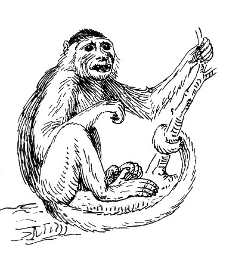

# Capuchin
> Lightweight, fluent TypeScript DOM manipulation library

Sick of doing this?
```typescript
let $foos = Array.from(document.querySelectorAll('.foo')) as Array<HTMLButtonElement>;
$foos.forEach($foo => {
    $foo.classList.add('bar');
    $foo.addEventListener('click', fooClicked);
});
```

Capuchin is a small TypeScript library to allow you to query & manipulate the DOM with a fluent, jQuery-like interface:
```typescript
$('.foo')
    .addClass('bar')
    .on('click', fooClicked);
```
